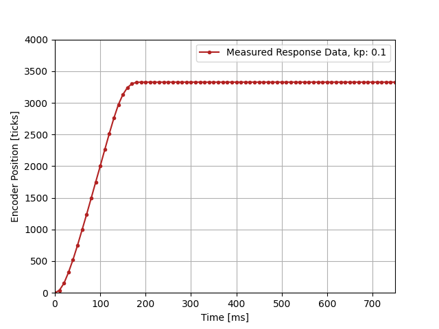
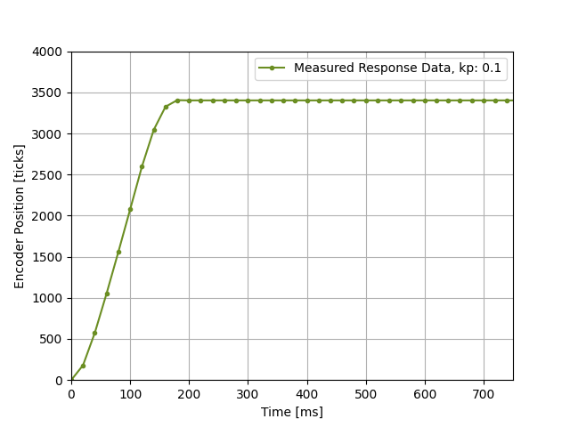
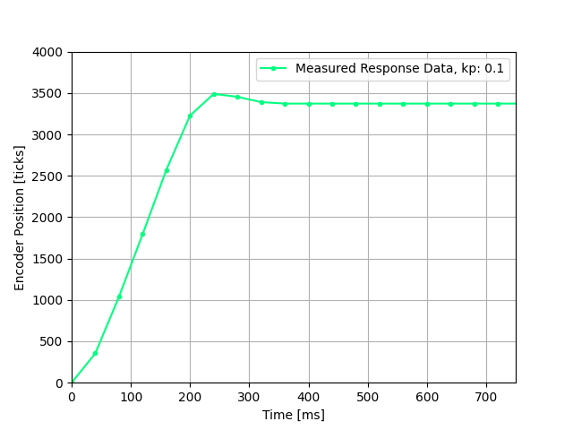
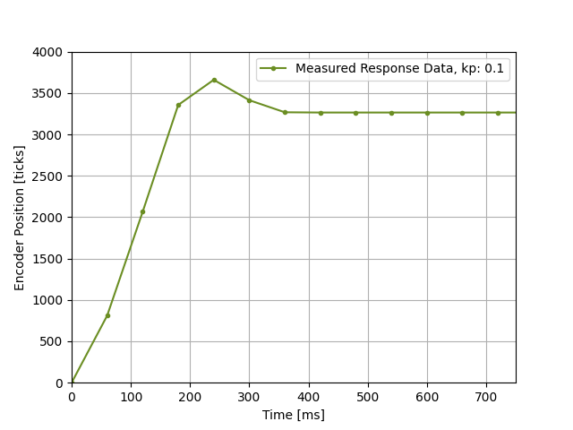
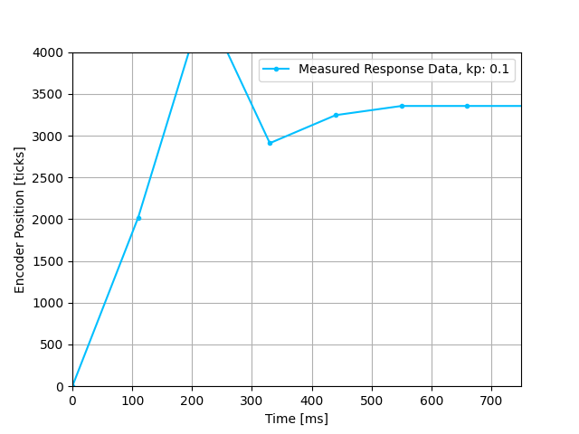

# me-405-lab4
 This repository contains code for ME-405 Lab 4. 

 Lab 4 focused on the implemenetaion of cooperative multitasking for closed loop DC motor controll. The lab utilizes previously created motor driver, encoder reader, control loop, and GUI to drive the step response. 

 cotask and taskshare are used to create the system of cooperative multitasking, and previous motor control functions are modified into a FSMs so two motors can be run simultaneously. Each motor function includes an "Init" state, a "Control loop" state, and "Print" state, and a "Done" state. When the GUI triggers a step response, each FSM cycles the states untill the response is completed, where it is graphed on the GUI. 

 Lab 4 includes the investigation of task timing in the effciacy of the closed loop control. The period of 1 motor control function was veried and the effect on step-response was recorded. 

10 ms Period

20 ms Period

30 ms Period

50 ms Period

100 ms Period

It can be seen that below a period of 20 ms, the multitasking step-response remains funciton. At 30ms, a change can be seen, and at 100 ms the control loop breaks down. This is due to the fact that the  motor-control task cannot update fast enough to keep up with the physical motor dynamics. 
